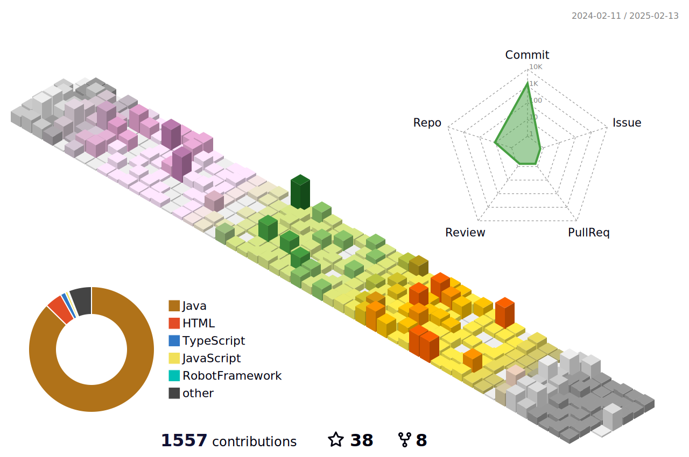

<h1 align="center">Hi 👋, I'm Cihat</h1>
<h2> 
Welcome to my page!:tada:
</h2>

	

<h2 align="center">🎤About Me</h2>

				- 👨‍💻 I am a ISTQB® CTFL Certified Software Test and Quality Assurance Specialist from Norway.
				- 🔭 I’m currently working on Information Technology.
				- 🌱 I’m currently learning testing tools and exploring technical content writing.
				- ⚡ In my free time, I solve problems on HackerRank and read tech articles.
			
<h2>
🧰Technologies and Tools
</h2>				
				

 
	 
	
	
	
	
	
	 
	 
	 
	
	 
	 
	 
	
	 
	
	
	
	
	
	
        
	 
	

<h2>
📊 GitHub Stats
</h2>

	
	
	
 
	
  
        </a>
	</a>

 

<a href="https://github.com/ryo-ma/github-profile-trophy">

<h2> 
 Keep coding! 💻 Stay awesome! ✨ 
</h2>

<h2>
📫 Connect With Me
</h2>

 
	 
	              
	 
	
	<a href="https://www.postman.com/cihatkose" target="_blank">
	
 

  

